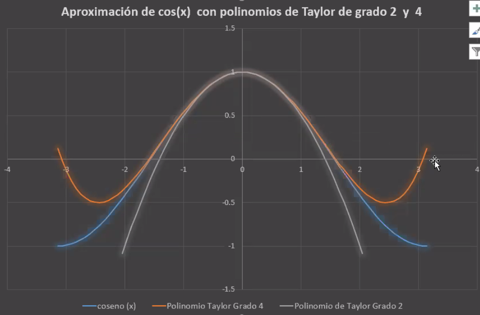
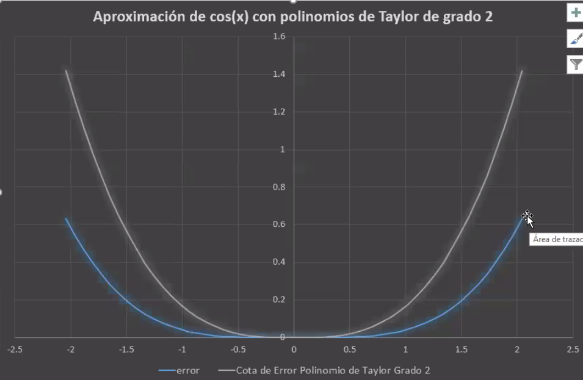
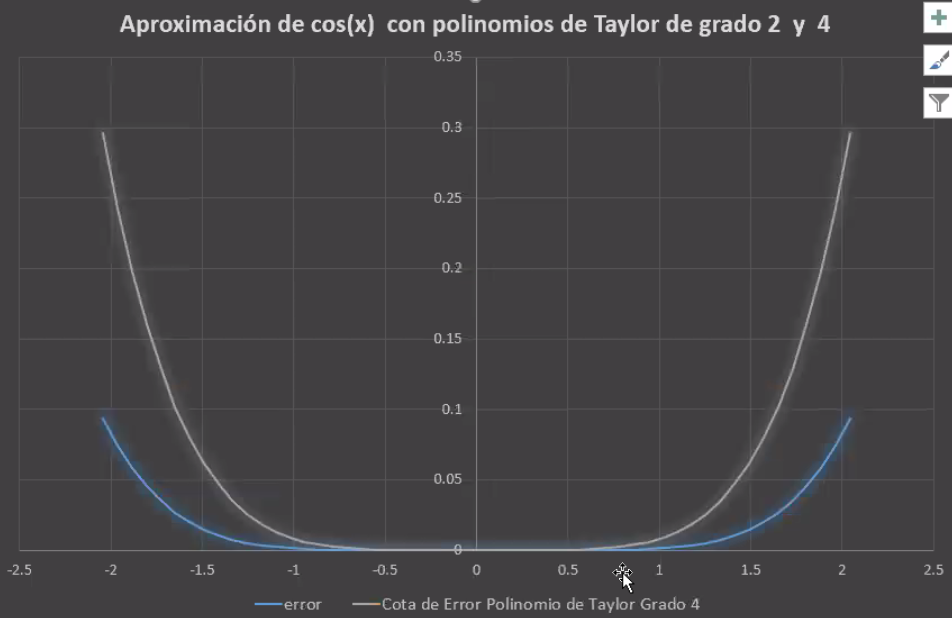
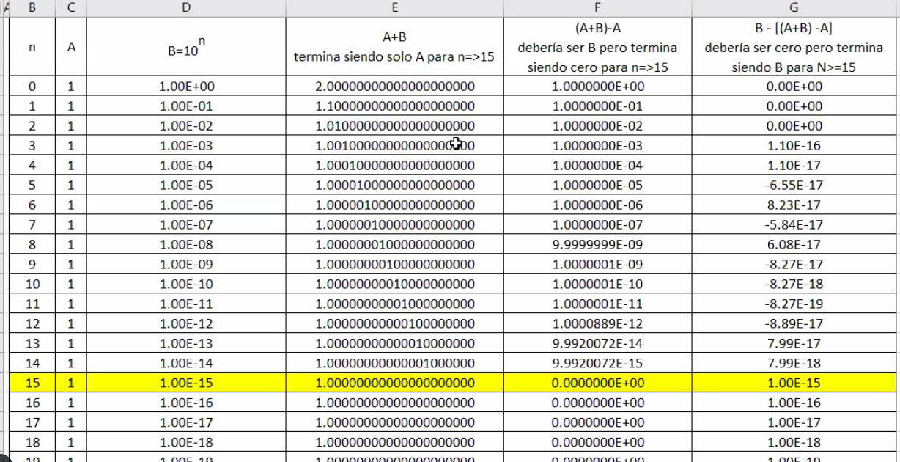

# Análisis Numérico vs. Análisis Matemático

En el análisis matemático, contamos con el concepto de infinito, el cual no es aplicable en el análisis numérico. Esto implica que conceptos como límites, derivadas e integrales no se manejan de la misma manera. En esta materia, desarrollaremos métodos numéricos que nos permitan transformar y abordar problemas matemáticos complejos, facilitando así la búsqueda de soluciones que podrían ser difíciles, costosas o incluso imposibles de calcular mediante métodos analíticos convencionales.

## Funciones Normales

Las funciones normales se pueden calcular mediante operaciones básicas como suma, resta, multiplicación, división y potenciación.

## Funciones Trascendentes

Las funciones que no se pueden resolver mediante las operaciones normales se denominan trascendentes. Ejemplos de estas incluyen funciones trigonométricas, logarítmicas, exponenciales y radicales.

## Teorema de Taylor

Sea $f \in C^n [a,b]$ tal que $f^{(n+1)}$ existe en $[a,b)$.

Si $x_0 \in [a,b]$, entonces, $\forall x_0 \in [a,b]$, $\exists \xi(x)$ entre $x_0$ y $x$ tal que:

$$f(x) = P_n(x) + R_n(x)$$

donde

$$P_n(x) = \sum_{k=0}^{n} \frac{f^{(k)}(x_0)}{k!} (x-x_0)^k$$

y

$$R_n(x) = \frac{f^{(n+1)}(\xi(x))}{(n+1)!} (x-x_0)^{(n+1)}$$

Resolver $P_n(x)$ constituye el enfoque de un problema numérico. Este proceso es una aproximación, ya que no utilizaremos un número infinito de términos, sino una cantidad limitada, siendo conscientes de que cuanto más términos usemos, más se aproximará nuestro valor numérico al valor matemático real.

### Ejemplo aproximando cos(x)

Calculamos las derivadas de $f(x) = \cos(x)$ en $x_0 = 0$ hasta el orden 4 y construir el polinomio de Taylor de grado 2 y 4.

Como vemos cuantos mas terminos de Taylor usamos, más nos acercamos a la función real y por un entorno alrededor del punto cada vez más grande.

Por otro lado, el teorema de Taylor nos dice que $\xi(x)$ se encuentra entre $x_0$ y $x$, por lo que si reemplazamos ambos extremos en la función de error $R_2(x)$, podemos hallar un límite inferior ($|P_2(x)|$) y un límite superior ($|x|^3 / 6$), ya que el módulo del seno está limitado por 1. Tomamos el módulo para obtener una cota positiva, ya que se trata de un error y no tiene sentido tener un error negativo. Cabe aclarar que el error no se puede calcular, pero sí se puede acotar.

Por otro lado, si usamos el polinomio de Taylor de grado 4, obtenemos una cota superior de $|x|^5 / 120$.

## Limitaciones de la Precisión en Computadoras

Las computadoras enfrentan limitaciones en la representación de números con precisión debido al formato de coma flotante. Esto se manifiesta, por ejemplo, en programas como Excel, donde la precisión puede comenzar a degradarse después de 14 o 15 órdenes de magnitud de diferencia, aunque esto puede variar dependiendo de si el programa es de 32 bits o de otra especificación.

En este caso particular, vemos que al realizar operaciones básicas con numeros de distintos ordenes, la computadora comienza a perder precisión. Esto se debe a la implementación de los números de coma floatante en la computadora que si bien puede representar un rango muy grande de números y a su vez puede representar números muy pequeños, no es capaz de operar con ellos cuando las magnitudes son muy dispares, tendiendo a fallos de precisión como en el caso de Excel.

## Importancia del Orden de las Operaciones en Algoritmos

Como vimos hacer operaciones con números de distintos órdenes de magnitud puede llevar a errores de precisión. Por esto, es importante tener en cuenta el orden de las operaciones en algoritmos numéricos para evitar errores de precisión y obetener mejores aproximaciones a los valores reales. Para ello, podemos agrupar las operaciones de manera tal que se minimice la pérdida de precisión, por ejemplo, realizando primero las operaciones con números de mayor magnitud y luego las de menor magnitud teniendo que perden presición solamente cuando vayamos a hacer la operación que una a los dos números de distintos órdenes, maximizando así la precisión de los resultados finales.
