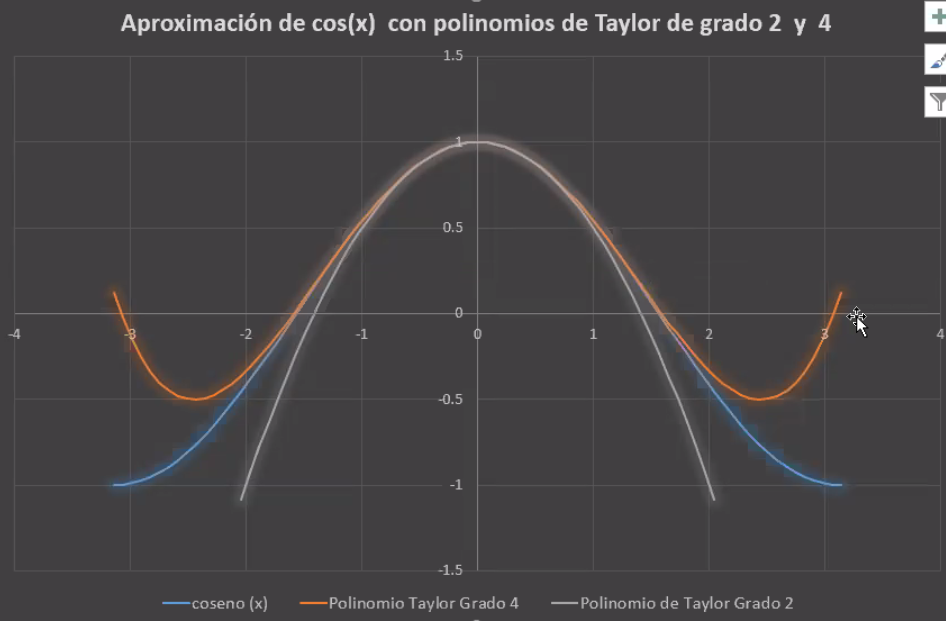
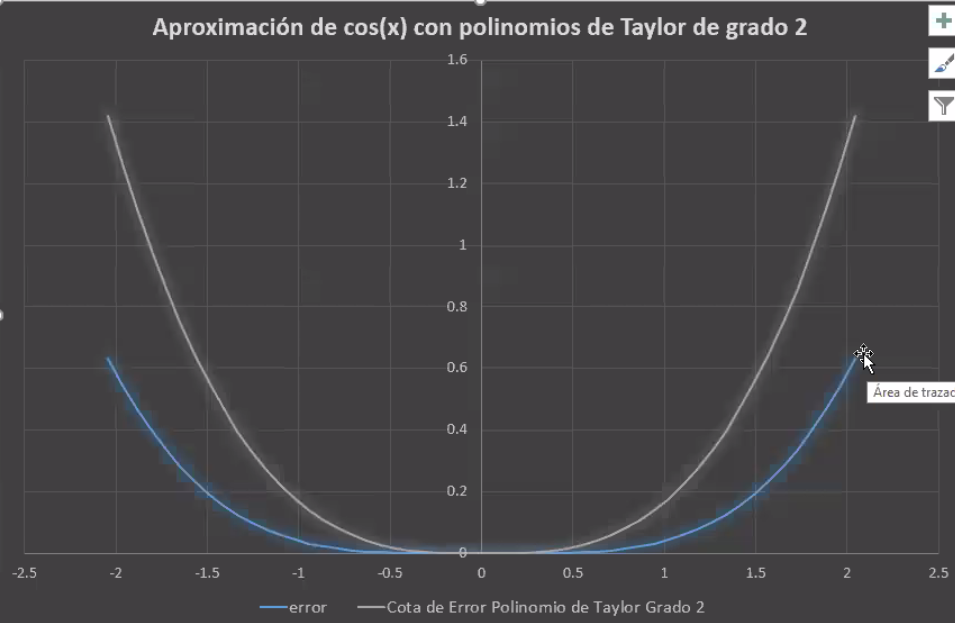

# Análisis Numérico vs Análsis Matemático

En el análisis matemático tenemos el concepto de infinito, en el numerico no, por ende no podemos tener limites ni nada derivado de ello (derivadas, integrales, etc.) por ende en la materia vamos a desarollar metodos numericos para transformar problemas matemáticos en numéricos, hayando así soluciones a problemas mátematicos dificiles, costos o imposibles de calcular.

## Funciones normales

Se pueden calcular usando:

Suma, resta, multiplicaión, divison, elevar

## Funciones transcendentes

Cuando no se puede resolver mediante funciones normales, se las denomina transcendentes por ejemplo:

Trigonometricas, logarimicas, exponenciales, raiz

## Teorema de Tayor

f pertenes a C^n [a,b] f^(n+1) existe en [a,b) x0 pertenece [a,b]

para todo x0 pertenece [a,b] Existe Episolon(x) entre x0 y x tal que:

f(x) = Pn(x) + Rn(x)

donde Pn(x) = sum desde k=0 hasta n (f'(k) (x0))/(k!) (x-x0)^k

Rn(x) = (f'(n+1)(Epsion(x)))/(n+1)! (x-x0)^(n+1)

Resolver Pn(x) sería resolver un problema numerico

Se trata de una aproximación ya que no vamos a hacer n terminos sino una cantidad reducida, sabiendo que cuantos mas usamos, mas aproximado será este al valor matemático.

Podemos ver que cuanto mas grados tiene el polinomio, más nos podemos acercar a la función real y por un entorno un poco más grande.

En este caso, como el teorema dice Epsilon(x) se encuentra en x0 y x entoces si reemplazamos ambos es la funcion de R2 (por ejemplo), podemos hallar un limite inferior (|P2(x)|) y el superior (|x|^3 / 6) (ya que el modulo del seno, esta limitado por 1)

Tomo modulo para hallar una cota positva ya que se trata de un error y no tiene sentido tener un error negativo

El error no se puede calcular, se puede acotar

## Limite de Excel (de la computadora)

El numero A siempre es 1

Esto es un tema de los numeros de coma flotant, la computadora al guardarlos no es capaz de representar con tanta exactitud los numeros por ende empieza a hacer redondeos.

En particular (y seguramnte porque excel es de 32 bits) deja de tener poder de representación cuando hay 14 o 15 ordenes de magnitud de diferencia (siendo cada order 10). Yo entiendo que si orden es el decimal, deberían ser 32 ordenes.

## Algoritmo

La moraleja del punto anterior, el orden de las operaciones IMPORTA ya que cada vez que operamos entre numeros de una magnitud significativamente distinta perdemos precision y aumentamos el error. Por ende conviene siempre agrupar por magnitud y operar la menor cantidad de veces entre magnitudes distintas.

Esto se llama algoritmo, es un método que usamos para resolver problemas matemáticos de forma aproximada, pero calculable por una computadora. Existen mejores y peores por su puesto y ese es desarollo que haremos en esta materia.

<!-- <melucallebaut@gmail.com> para cambio de curso -->
