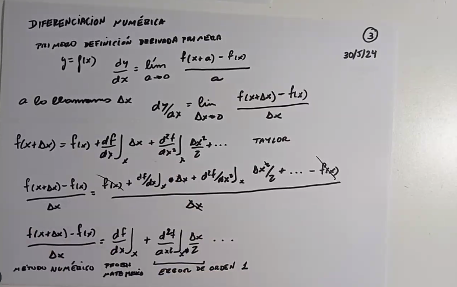
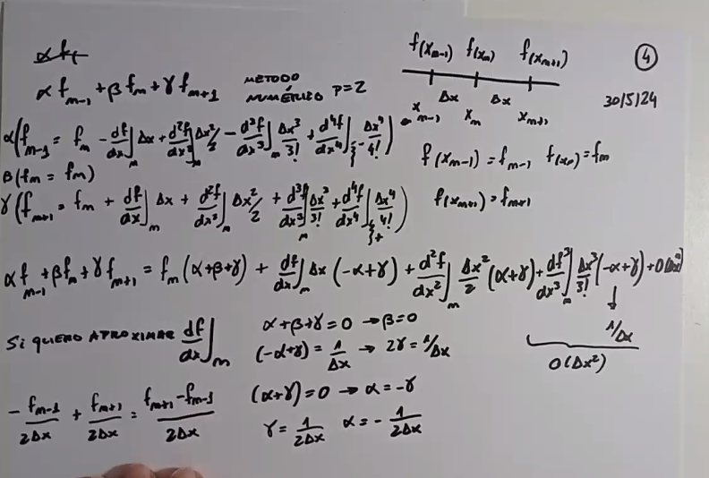
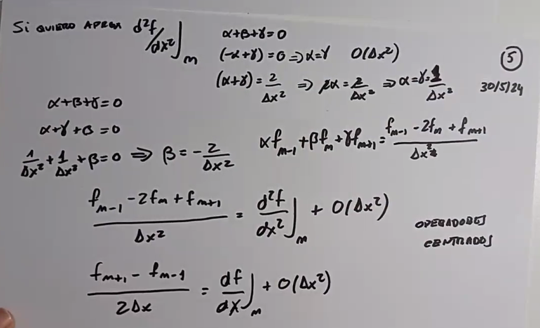

# Clase 10 - Diferenciación numérica

Se deben buscar los \alpha, \beta y \gamma tal que la siguiente ecuación nos permita encontrar el valor de la derivada deseada en el punto $x_n$ sabiendo los valores de la derivada en los puntos $x_{n-1}$ y $x_{n-2}$.

$$ x_{n-1} = x_n - \Delta x $$
$$ x_{n+1} = x_n + \Delta x $$

$$f(x_{n-1}) = f(x_n) - \Delta x \frac{df}{dx} + \frac{\Delta x^2}{2} \frac{d^2f}{dx^2} - O(\Delta x^2)$$

$$f(x_n) = f(x_n)$$

$$f(x_{n+1}) = f(x_n) + \Delta x \frac{df}{dx} + \frac{\Delta x^2}{2} \frac{d^2f}{dx^2} + O(\Delta x^2)$$

$$\alpha f(x_{n-1}) + \beta f(x_n) + \gamma f(x_{n+1}) = \frac{df}{dx}$$

Si ignoramos los terminos de $O(\Delta x^2)$, podemos despejar $\alpha$, $\beta$ y $\gamma$.

$$\alpha = \frac{1}{2 \Delta x}$$
$$\beta = 0$$
$$\gamma = -\frac{1}{2 \Delta x}$$

Si quiero calcular la \frac{d^2f}{dx^2} puedo hacer lo siguiente:

$$\alpha f(x_{n-1}) + \beta f(x_n) + \gamma f(x_{n+1}) = \frac{d^2f}{dx^2}$$

Resuelvo el sistema de ecuaciones y obtengo:

$$\alpha = \frac{1}{\Delta x^2}$$
$$\beta = -\frac{2}{\Delta x^2}$$
$$\gamma = \frac{1}{\Delta x^2}$$

Despreciamos los términos de $O(\Delta x^2)$ ya que estamos trabajando con un método de orden 2.

Si buscamos un método de orden superior, necesitamos más puntos.
