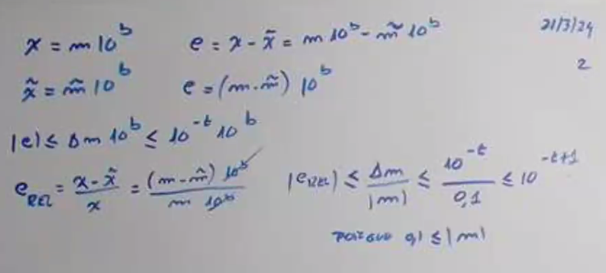
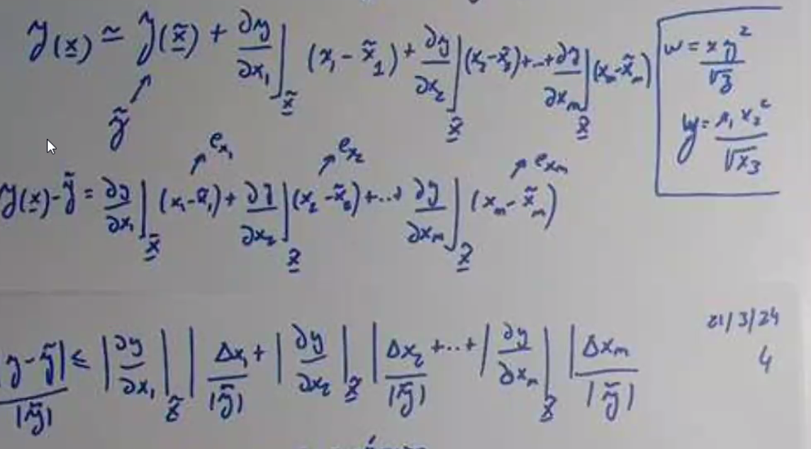
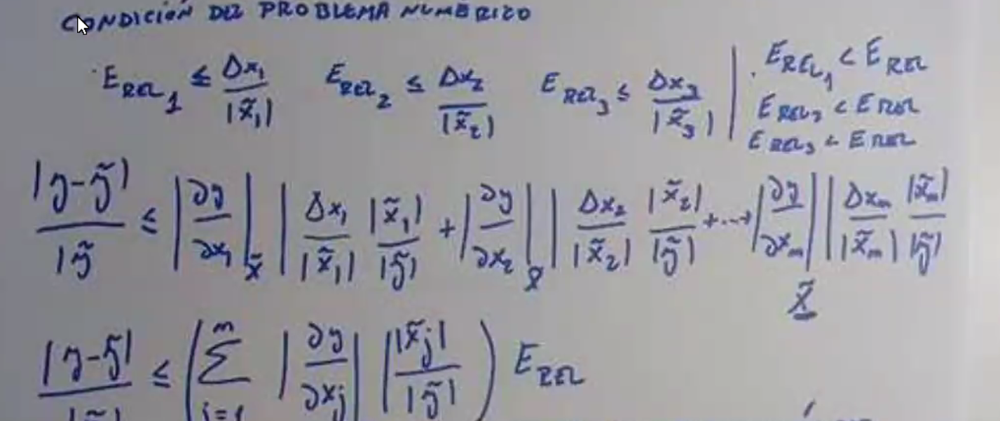
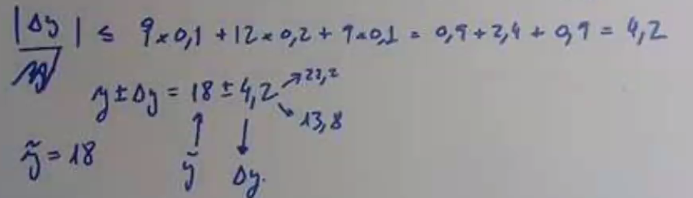
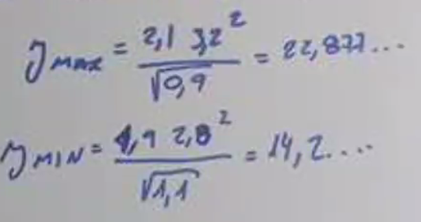

# Clase 2

## Representación en punto flotante

$x = (-1)^s \cdot M \cdot b^E$

Donde:

- $s$ es el signo
- $M$ es la mantisa
- $b$ es la base
- $E$ es el exponente

### Normalización

La forma normalizada de un número en punto floante siempre tiene un 1 en la mantisa y se representa como:

$1 > |M| \geq 0,1$

Esto significa que para estar normalizado, la mantiza tiene que estar siempre entre 1 y 0,1.

### Representación Computacional

La computadora representa los números en punto flotante almacenando el signo, la mantisa, y el exponente, utilizando la base 2 para la representación. Las distintas partes se almacenan según las siguientes reglas:

- **Signo**: Se utiliza 1 bit, siendo 0 para números positivos y 1 para negativos.
- **Mantisa**: Se almacena con 23 bits en la representación de 32 bits (float) y con 52 bits en la de 64 bits (double).
  - En la forma normalizada, el primer bit (que siempre es 1) no se almacena.
  - Se emplea redondeo para ajustar la mantisa a su tamaño limitado.
- **Exponente**: Usa 8 bits en la representación de 32 bits y 11 bits en la de 64 bits, aplicando un desplazamiento (bias) de 127 para 32 bits y 1023 para 64 bits.

## Redondeo

El redondeo es el proceso de aproximar un número con muchos decimales a un número con menos decimales que se pueda representar. En el proceso siempre se pierde precisión.

### Tipos de Redondeo

- **Redondeo simétrico**: Redondea al número más cercano; si equidistante, al par más cercano.
- **Redondeo por truncamiento**: Elimina los dígitos que exceden la precisión permitida, aproximando al número más cercano por defecto.

### Error de redondeo

El error de redondeo representa la diferencia entre el valor real y el valor aproximado, calculándose como:

- Para truncamiento: $$\Delta_m \leq 10^{-t}$$
- Para redondeo simétrico: $$\Delta_m \leq \frac{10^{-t}}{2}$$

Donde $t$ es la cantidad de dígitos representables.

## Errores en la Aproximación

Los errores se clasifican en:

- **Error absoluto**: Diferencia entre el valor real y el valor aproximado.
- **Error relativo**: Proporción del error absoluto respecto al valor real, brindando una medida de la precisión relativa.

## Buscamos la cota de punto flotante

Caso truncamiento: (moño = guardado, t = cantidad de dígitos)

En el caso simétrico, el error es la mitad del error del truncamiento.

El error absoluto es variable dependiendo del exponente, por lo que es mejor usar el error relativo ya que es independiente del exponente.

## Tipos de Punto Flotante

- **Float / Simple precisión**: 32 bits de longitud.
- **Double / Doble precisión**: 64 bits de longitud.

## Propagación de errores

Es inherente a los datos.

$$ \underline x = \begin{pmatrix} x_1 \\ x_2 \\ ... \\ x_n \end{pmatrix} \underline {\tilde{x}} = \begin{pmatrix} \tilde{x_1} \\ \tilde{x_2} \\ ... \\ \tilde{x_n} \end{pmatrix}$$

$$ \underline y = y(x_1, x_2, ..., x_n) = y(\underline x) $$

$ e_y = \underline y - \underline {\tilde{y}} = y(\underline x) - y(\underline {\tilde{x}}) $

$ e_{x_n} = x_n - \tilde{x_n} $

$ \tilde{y} = y(\tilde{x_1}, \tilde{x_2}, ..., \tilde{x_n}) = y(\tilde{\underline{x}}) $

$ |e_{x_n}| \leq \Delta{x_n} $

### Podemos aplicar Taylor para aproximar $y(\underline{x})$

$ y(\underline{x}) \approx y(\underline{\tilde{x}}) + \sum_{i=1}^{n} \frac{\partial y}{\partial x_i} e{x_i} $

### Condición del problema numérico

$$ E_{REL_n} \leq \frac{\Delta x_n}{\tilde{x_n}} $$

$$ E_{REL_n} < E_{REL} $$

$$ \frac{|y-\tilde{y}|}{|y|} \leq (\sum_{i=1}^{n} |\frac{\partial y}{\partial x_i}|_{\underline{\tilde{x}}} |  \frac{|\tilde{x_i}|} {|\tilde{y}|} ) E_{REL} $$

El numero que está entre parentesis es el número de condición del problema numérico. Si es muy grande, el problema es mal condicionado.

### Ejemplo

$ y = \frac{x_1 + {x_2}^2}{\sqrt{x_3}} $

habría que hacer las derivadas y evaluarlas en el punto para obtener el número de condición del problema numérico.

Otra alternativa es maximizar y minimzar el valor de y variando los valores de x.

Para el máximo: x1 y x2 lo maximizamos en 1 y x3 lo minimizamos.

Para el mínimo: x1 y x2 lo minimizamos en 0 y x3 lo maximizamos.

Podemos calcular el error relativo con la fórmula:

$ E_{REL} = \frac{\Delta y}{\tilde{y}} $
