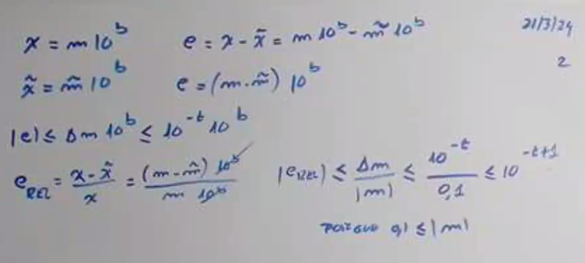
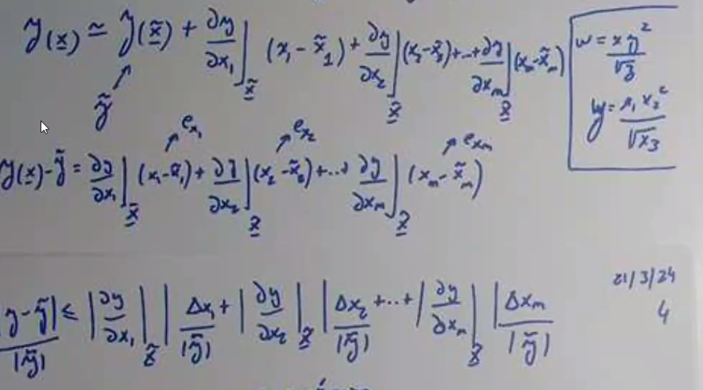
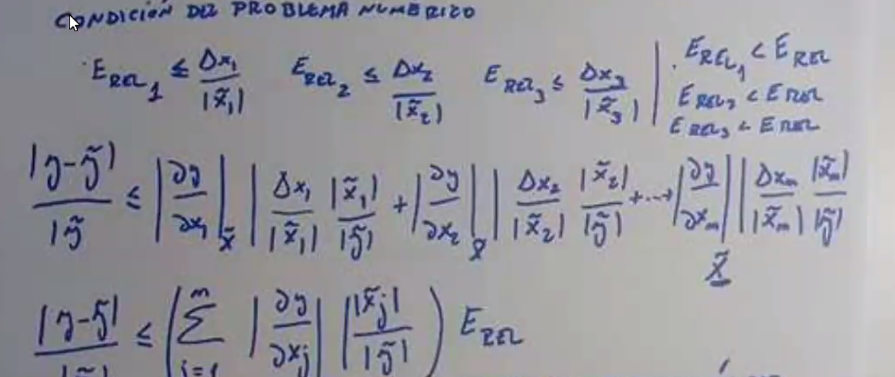
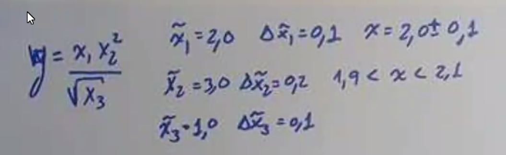
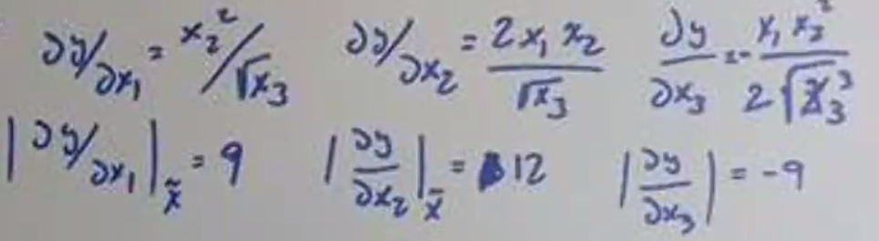
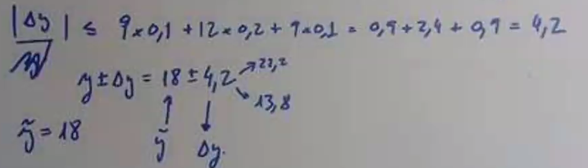
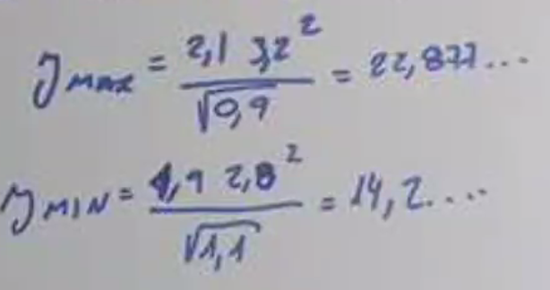

# Clase 2

## Representación en punto flotante

$x = (-1)^s * M * b^E$

Donde:

- $s$ es el signo
- $M$ es la mantisa
- $b$ es la base
- $E$ es el exponente

### Normalización

La forma normalizada de un número en punto floante siempre tiene un 1 en la mantisa y se representa como:

$1 > |m| \geq 0,1$

Esto significa que para estar normalizado, la mantiza tiene que estar siempre entre 1 y 0,1.

### Representación que usa la computadora

La computadora almacena los números en número flotante almancenando el signo, la mantisa y el exponente y designando la base siempre como 2.

Cada parte de la representación usa diferentes reglas:

- El signo se representa con un bit, donde 0 es positivo y 1 es negativo.

- La mantisa se representa con 23 bits en la representación de 32 bits y 52 bits en la representación de 64 bits.

  - Usando la representación normalizada, el primer bit siempre es 1, por lo que no se almacena.

  - Se usa el protocolo de redondeo para representar la mantisa

- El exponente se representa con 8 bits en la representación de 32 bits y 11 bits en la representación de 64 bits.

  - Se usa el protocolo de exceso a 127 en la representación de 32 bits y exceso a 1023 en la representación de 64 bits.

## Redondeo

El redondeo es el proceso de aproximar un número con muchos decimales a un número con menos decimales que se pueda representar. En el proceso siempre se pierde precisión.

### Redondeo simétrico

El redondeo simétrico es el proceso de redondear un número hacia el número más cercano, si el número es equidistante entre dos números, se redondea al número par más cercano.

### Redondeo por truncamiento

El redondeo por truncamiento es el proceso de redondear un número hacia el número más cercano, eliminando los dígitos que no se pueden representar.

### Error de redondeo

El error de redondeo es la diferencia entre el número real y el número redondeado. Este error siempre es positivo y se puede calcular con la fórmula:

Si $t$ es la cantidad de dígitos que se pueden representar, el error de redondeo se puede calcular con la fórmula:

En el caso del truncamiento: $D_m \leq 10^{-t}$

En el caso del simétrico: $D_m \leq 10^{-t} /2$

## Errores

Existen dos tipos de errores.

### Error absoluto

El error absoluto es la diferencia entre el valor real y el valor aproximado.

### Error relativo

El error relativo es el error absoluto dividido entre el valor real. Es decir porcentualmente cuánto se equivocó la aproximación. Este es mucho más útil para comparar errores entre diferentes aproximaciones ya que no depende de la magnitud del número.

## Buscamos la cota de punto flotante

Caso truncamiento: (moño = guardado, t = cantidad de dígitos)

<!-- pasar a latex -->

En el caso simétrico, el error es la mitad del error del truncamiento, por lo que la cota es ...

El error absoluto es variable dependiendo del exponente, por lo que es mejor usar el error relativo ya que es independiente del exponente.

## Tipados de punto flotante

Los tipados más comunes para punto flotante son:

### Float / Simple precisión

Tiene 32 bits de longitud. 1 bit para el signo, 8 bits para el exponente y 23 bits para la mantisa.

### Double / Doble precisión

Tiende 64 bits de longitud. 1 bit para el signo, 11 bits para el exponente y 52 bits para la mantisa.

## Propagación de errores

Es inherente a los datos.

$$ \underline x = \begin{pmatrix} x_1 \\ x_2 \\ ... \\ x_n \end{pmatrix} \underline {\tilde{x}} = \begin{pmatrix} \tilde{x_1} \\ \tilde{x_2} \\ ... \\ \tilde{x_n} \end{pmatrix}$$

$$ \underline y = \underline y(x_1, x_2, ..., x_n) = \underline y(\underline x) $$

$ e_y = \underline y - \underline {\tilde{y}} = \underline y(\underline x) - \underline y(\underline {\tilde{x}}) $

$ e_{x_n} = x_n - \tilde{x_n} $

$ \tilde{y} = y(\tilde{x_1}, \tilde{x_2}, ..., \tilde{x_n}) = y(\tilde{\underline{x}}) $

$ |e_{x_n}| \leq \Delta{x_n} $

### Podemos aplicar Taylor para aproximar $y(\underline{x})$

$ y(\underline{x}) \approx y(\underline{\tilde{x}}) + \sum_{i=1}^{n} \frac{\partial y}{\partial x_i} e{x_i} $

### Condición del problema numérico

$$ E_{REL_n} \leq \frac{\Delta x_n}{\tilde{x_n}} $$

$$ E_{REL_n} < E_{REL} $$

$$ \frac{y-\tilde{y}}{y} \leq (\sum_{i=1}^{n} |\frac{\partial y}{\partial x_i}|_{\underline{\tilde{x}}} |  \frac{\tilde{x_i}} {\tilde{y}} ) E_{REL} $$

El numero que está entre parentesis es el número de condición del problema numérico. Si es muy grande, el problema es mal condicionado.

### Ejemplo

$ y = \frac{x_1 + {x_2}^2}{\sqrt{x_3}} $

habría que hacer las derivadas y evaluarlas en el punto para obtener el número de condición del problema numérico.

Otra alternativa es maximizar y minimzar el valor de y variando los valores de x.

Para el máximo: x1 y x2 lo maximizamos en 1 y x3 lo minimizamos.

Para el mínimo: x1 y x2 lo minimizamos en 0 y x3 lo maximizamos.

Podemos calcular el error relativo con la fórmula:

$ E_{REL} = \frac{\Delta y}{\tilde{y}} $
