# Clase 3 - Aproximación de raíces por métodos iterativos

El objetivo es para una $f(x)$ hayar un valor $x$ tal que $f(x) = 0$. Como no siempre es posible encontrar una solución analítica, se recurre a métodos numéricos para encontrar una aproximación de la raíz.

## Método de la bisección

El método de la bisección es un método de búsqueda de raíces que divide el intervalo en dos partes iguales y selecciona el subintervalo en el que la función cambia de signo. Este proceso se repite hasta que se alcanza la precisión deseada.

La función debe de ser continua en un intervalo $[a, b]$ tal que $f(a) \cdot f(b) < 0$.

El método consiste en los siguientes pasos:

1. Se calcula el punto medio $c = ( a + b ) / 2$.
2. Se evalúa la función en el punto medio $f(c)$.
3. Se verifica si $f(c) = 0$ entonces se ha encontrado la raíz.
4. Se verifica si $f(a) \cdot f(c) < 0$ entonces la raíz está en el intervalo $[a, c]$ y se repite el proceso con este intervalo.
5. Caso contrario, la raíz está en el intervalo $[c, b]$ y se repite el proceso con este intervalo.

El método de la bisección converge linealmente, es decir, el error se reduce a la mitad en cada iteración. La convergencia es lenta, pero es garantizado que converge a la raíz si se cumplen las condiciones iniciales.

El error en la iteración $n$ está dado por la siguiente fórmula:

$$ |x_n - x| = \epsilon\leq \frac{|b - a|}{2^n} $$

## Método del punto fijo

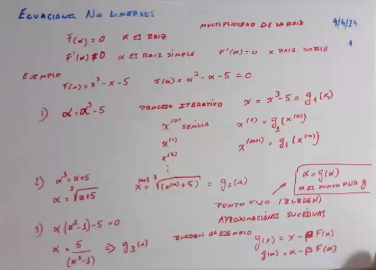

Para aplicar este método, se debe de reescribir la ecuación $f(x) = 0$ como $x = g(x)$. La función $g(x)$ debe de cumplir con las siguientes condiciones:

- **Continua:** $g(x)$ debe de ser continua en el intervalo $[a, b]$.
- **Condicion de Lipschitz:** $|g'(x)| \leq k < 1$ para todo $x$ en el intervalo $[a, b]$.
- **Convergencia:** la imagen de $g(x)$ debe de estar en el intervalo $[a, b]$ para todo $x$ en el intervalo $[a, b]$.

El método consiste en los siguientes pasos:

1. Se selecciona un valor inicial $x_0$ en el intervalo $[a, b]$.
2. Se calcula el siguiente valor $x_{n+1} = g(x_n)$.
3. Se verifica si $|x_{n+1} - x_n| < \epsilon$ donde $\epsilon$ es la tolerancia.
4. Caso contrario, se repite el proceso con el nuevo valor $x_{n+1}$.

El error en la iteración $n$ y el valor $k$ de la condición de Lipschitz están relacionados por la siguiente fórmula:

<!-- COMPLETAR -->
<!-- $$ |x_n - x| = \epsilon \leq \frac{k^n}{1 - k} |x_1 - x_0| $$ -->

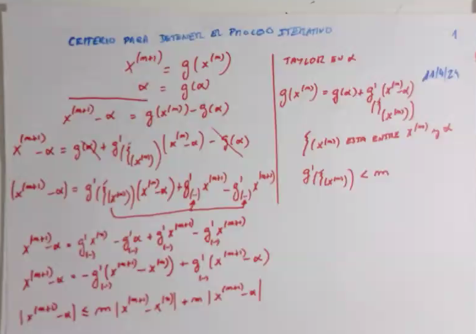

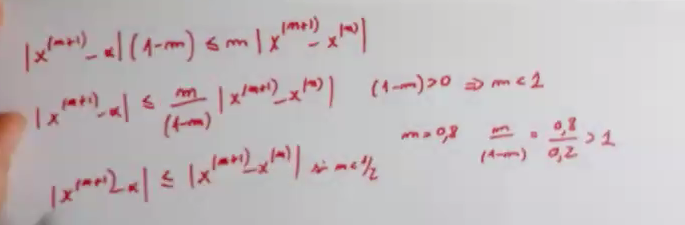

## Método de Newton-Raphson

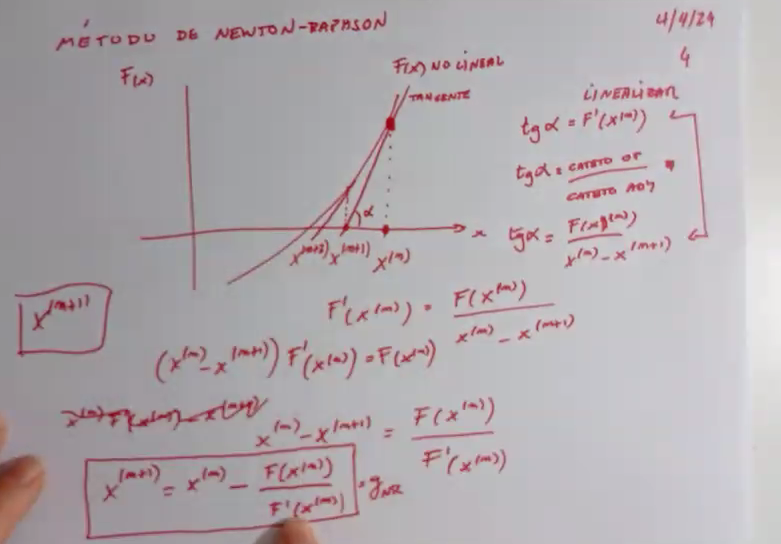

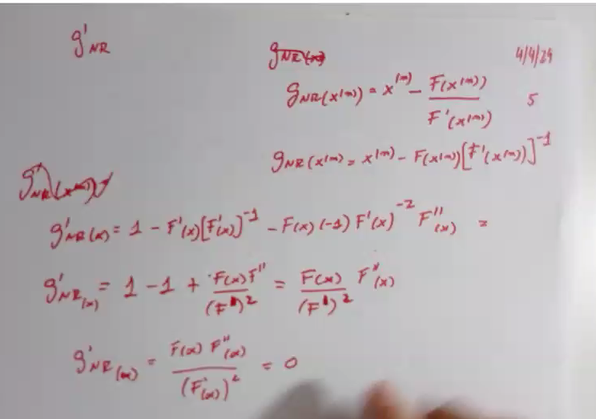

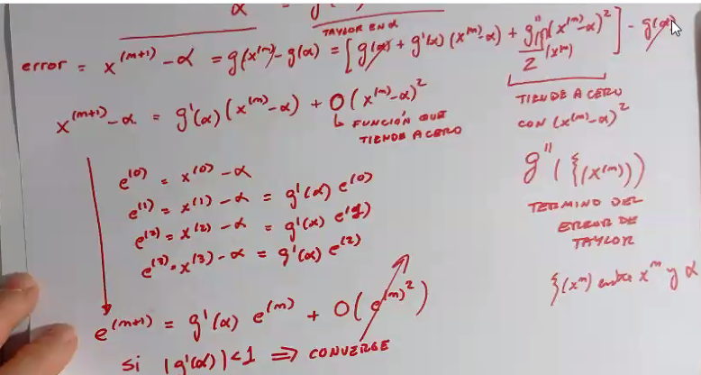

La idea de este método es aproximar la función $f(x)$ por una recta tangente en el punto $x_n$. La ecuación de la recta tangente es:

$$ y = f'(x_n) \cdot (x - x_n) + f(x_n) $$

La intersección de la recta tangente con el eje $x$ es:

$$ x_{n+1} = x_n - \frac{f(x_n)}{f'(x_n)} $$

Las condiciones para que el método de Newton-Raphson converja son:

- **Continuidad:** $f(x)$ y $f'(x)$ deben de ser continuas en el intervalo $[a, b]$.
- **Convergencia:** la derivada $f'(x)$ no debe de ser cero en el intervalo $[a, b]$.

Los pasos del método son los siguientes:

1. Se selecciona un valor inicial $x_0$.
2. Se calcula el siguiente valor $x_{n+1} = x_n - \frac{f(x_n)}{f'(x_n)}$.
3. Se verifica si $|x_{n+1} - x_n| < \epsilon$ donde $\epsilon$ es la tolerancia.
4. Caso contrario, se repite el proceso con el nuevo valor $x_{n+1}$.

El error del método esta dado por la siguiente fórmula:

<!-- $$ |x_n - x| = \epsilon \leq \frac{|f(x_n)|}{|f'(x_n)|} $$ -->

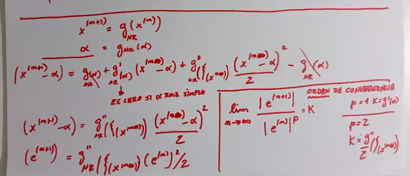

Si la raíz es doble o múltiple, la convergencia pierde su propiedad cuadrática y se convierte en lineal.

## Método de la secante

Evitas las derivadas

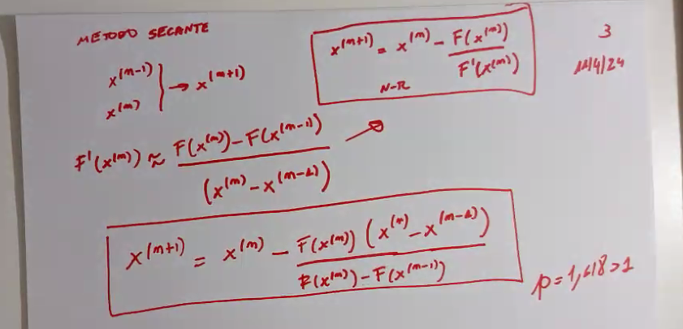

## Método regula falsi

Similar al método de la bisección, pero se selecciona el punto que se encuentra en la intersección de la recta que une los puntos $a$ y $b$ con el eje $x$. Tiene una convergencia más rápida que el método de la bisección pero requiere más cálculos.

## Teorema general para acotar el error

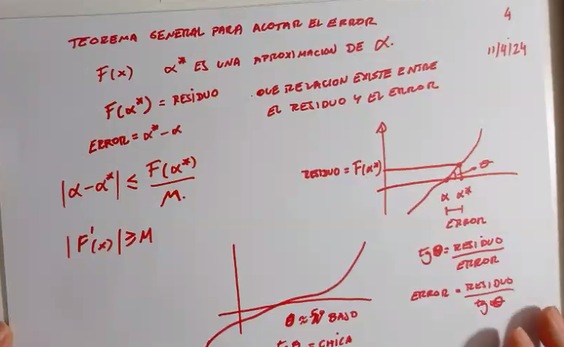

Se demuestra con Taylor

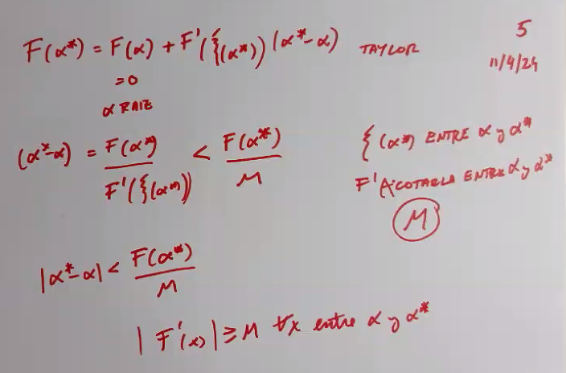

## Comparación de métodos

Para comparar los métodos se pueden evaluar las siguientes variables:

- **$p$:** orden de convergencia
- **$\lambda$:** constante asintótica de convergencia

Normalmente se busca que $p$ sea lo más grande posible y $\lambda$ lo más pequeño posible, siendo el más influyente el orden de convergencia.

Newton-Raphson se destaca por los demás métodos por tener un orden de convergencia de 2, a diferencia de los demás métodos que tienen un orden de convergencia de 1 y juegan con la constante $\lambda$.

El método de la secante tiene un orden de convergencia de ~1.618, lo que lo hace más rápido que el método de la bisección y regula falsi pero más lento que Newton-Raphson.

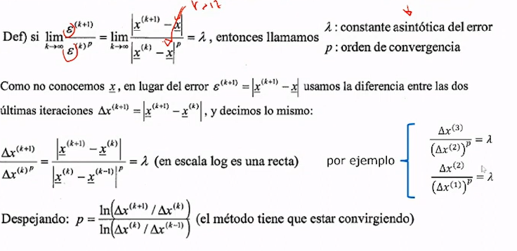
