# Clase 4 - Sistemas de ecuaciones lineales

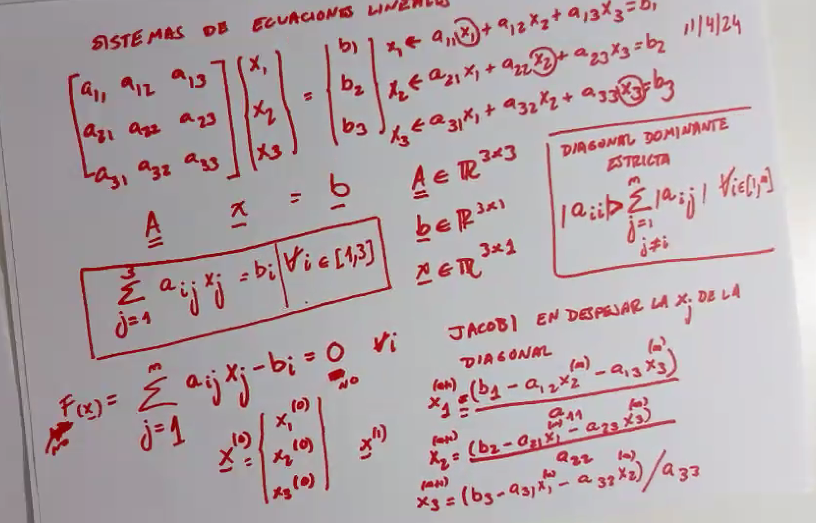

## Metodo de Jacobi y Gauss Seidel

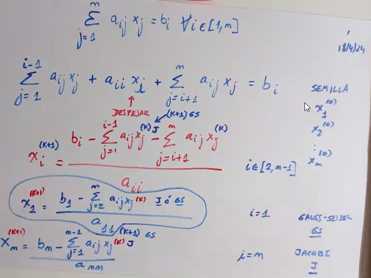

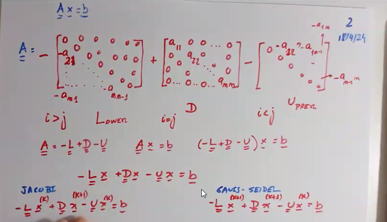

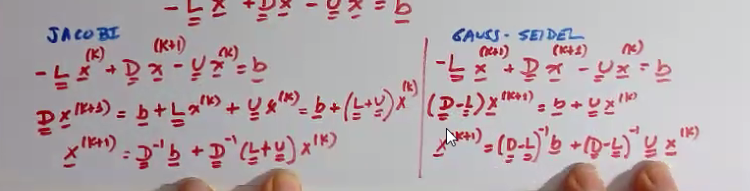

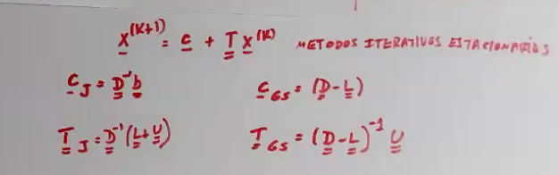

## Norma

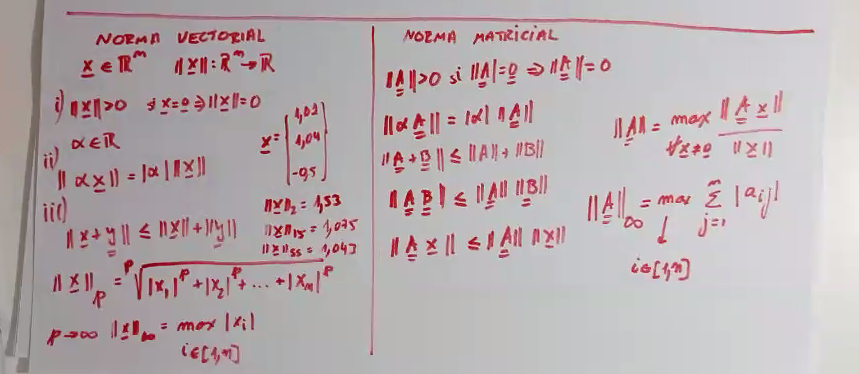

La norma infinito es un caso particular de la norma matricial (si entendí bien)

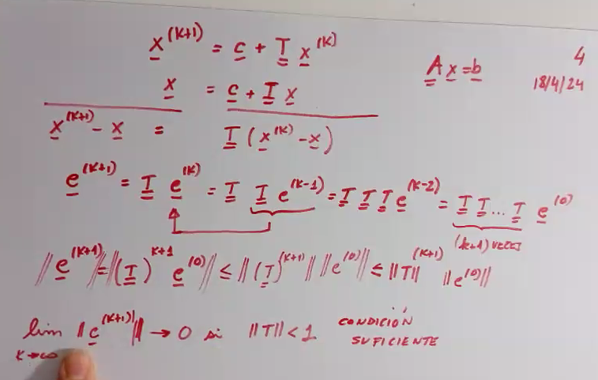

## Usarlo

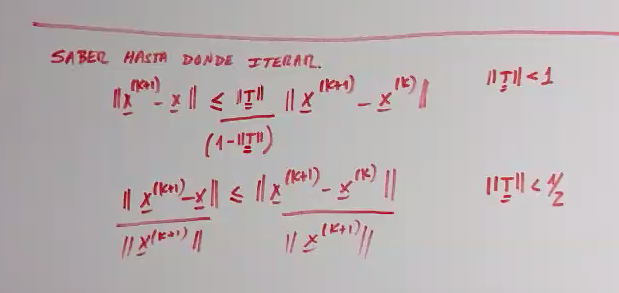

## Gaus Seidel relajado

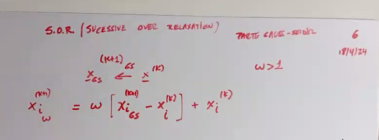

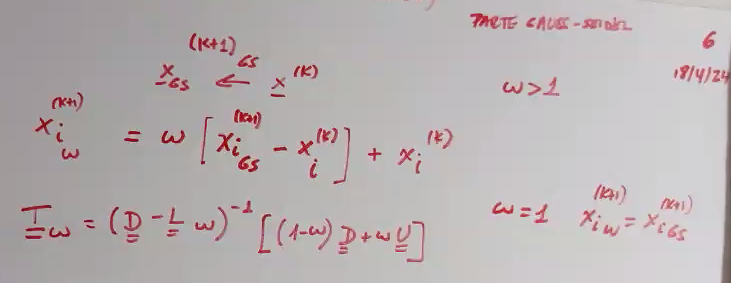

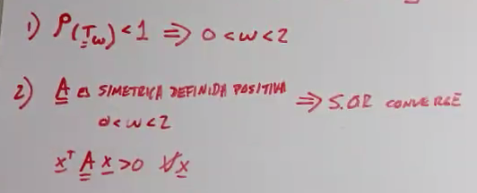

La idea es trabajar en este rango para no tener problemas de convergencia

### Tridiagonal en bloques

