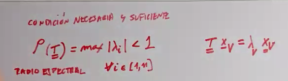
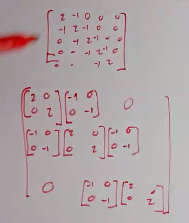

# Clase 4 - Sistemas de ecuaciones lineales

## Metodo de Jacobi y Gauss Seidel

## Norma

La norma infinito es un caso particular de la norma matricial (si entendí bien)

## Usarlo

## Gaus Seidel relajado

La idea es trabajar en este rango para no tener problemas de convergencia

### Tridiagonal en bloques

