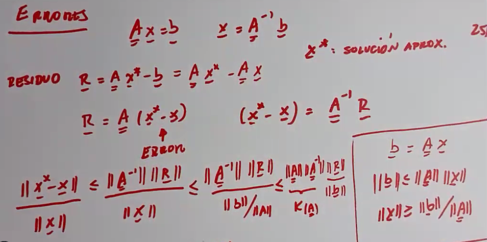

# Clase 5 - Metodos directos

## Métodos directos vs métodos iterativos

Las ventajas de los métodos iterativos, es que es que no arrastra el error acumulado ya que se puede pensar como que siempre se parte de una raiz. Además, es mucho más facil de computar, ya que el proceso se puede paralelizar y por ende correr en muchos procesadores a la vez.

Por otro lado...

## Método de eliminación de Gauss

Este método consiste en transformar una matriz en una matriz triangular superior, para luego resolver el sistema de ecuaciones lineales. La matriz triangular superior es una matriz donde todos los elementos debajo de la diagonal son cero.

Una vez tenemos la matriz triangular superior, podemos resolver el sistema de ecuaciones lineales de forma sencilla. La idea es resolver la última ecuación, y luego sustituir el valor de la incógnita en la penúltima ecuación, y así sucesivamente.

### Como conseguir la matriz U

Se resuelve mediante operaciones lineales elementales, que no cambian la solución del sistema de ecuaciones lineales. Las operaciones elementales son:

- Multiplicar una fila por un escalar distinto de cero.
- Sumar una fila a otra fila multiplicada por un escalar.
- Intercambiar dos filas.

Hay que tener cuidado con los pivotes, ya que si un pivote es cero, no se puede dividir por él. En ese caso, se debe de intercambiar la fila con otra fila que tenga un pivote distinto de cero. Si no se puede hacer esto, el sistema de ecuaciones lineales no tiene solución.

El problema con esto es que el error se va acumulando y se propoga y este error puede ser muy grande aunque el error relaaivo sea pequeño y este acotado.

### Factorización

Se puede guardar una matriz L que guarda los multiplicadores de la matriz U, y se puede resolver el sistema de ecuaciones lineales de la siguiente forma:

$$ L \cdot U = A $$

Por otro lado en el caso de hacerse pivoteo, se puede guardar una matriz P que guarda los intercambios de filas, y se puede resolver el sistema de ecuaciones lineales de la siguiente forma:

$$ L \cdot U = P \cdot A $$

### Errror

El error no solo depende del residuo, sino también del K(A) que es el número de condición de la matriz A.

Ambos son directamente proporcionales al error relativo.

Se dice que una matriz está mal condicionada si el número de condición es muy grande, y en ese caso, el error puede ser muy grande. Un ejemplo es la matriz de Hilbert, cuyo número de condición crece exponencialmente con el tamaño de la matriz.

$$ h_{ij} = \frac{1}{i + j - 1} $$
<!-- print matrix with dots... -->
$$ H_n =  \begin{bmatrix} 1 & \frac{1}{2} & \cdots & \frac{1}{n} \\ \frac{1}{2} & \frac{1}{4} & \cdots & \frac{1}{n+1} \\  \vdots & \vdots & \ddots & \vdots \\ \frac{1}{n} & \frac{1}{n+1} & \cdots & \frac{1}{2n-1} \end{bmatrix} $$

### Wilkinson 1950

Acá wilkinson descubrio como se podía cuantificar el error en sistemas grandes ya que a mano no se podía calcular originalmente y con la computadora a veces daba bien y otras mal. Entonces Wilkinson se tuvo que poner a estudiar la propagación de errores para entender que estaba pasando.

### Refinamiento iterativo

Podemos usar un método iterativo para mejorar la solución obtenida por un método directo. La idea es resolver el sistema de ecuaciones lineales con un método directo, y luego usar un método iterativo para mejorar la solución. Para esto guardamos anteriormente la factorización de la matriz A, ya que podemos reutilizar los factores L y U para refinar la solución y reducir el error (sino me equivoco el residuo).

$-q$ es la cantidad de dígitos significativos resultantes.
$k$ indica que tan mal condicionada está la matriz.
$t$ es el número de dígitos de la mantisa.

Si $k$ es mayor a $t$ entonces no vale la pena hacer el refinamiento iterativo ya que la solución no va a ser mejor debido a la mala condición de la matriz.
