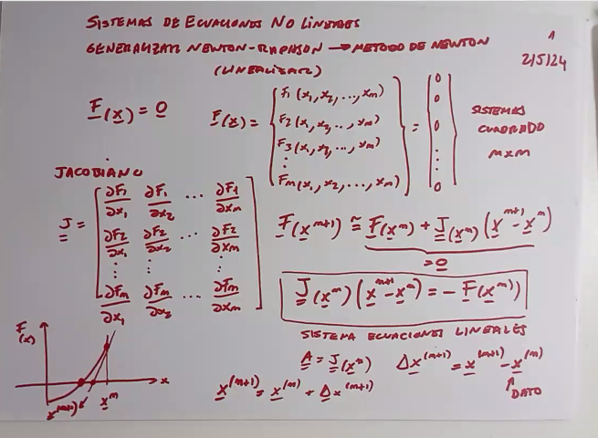

# Clase 6 - Sistemas de ecuaciones no lineales

Mismo problema que en la clase 5, pero ahora con una funciones no lineales.

## Método de Newton

Es como el método de Newton-Raphson, pero mucho más general ya que admite trabajar en $n$ dimensiones.

La idea es que si tenemos una función $f: \mathbb{R}^n \rightarrow \mathbb{R}^n$, y queremos encontrar la raíz de $f$, hablando en terminos vectoriales.

$$ \underline{f}(\underline{x}) = \begin{bmatrix} f_1(\underline{x}) \\ \vdots \\ f_n(\underline{x}) \end{bmatrix} = \underline{0} $$

Para ello deberemos de calcular la matriz jacobiana de $f$, que es una matriz de $n \times n$ que contiene las derivadas parciales de $f$.

$$ \underline{J} = \begin{bmatrix} \frac{\partial f_1}{\partial x_1} & \cdots & \frac{\partial f_1}{\partial x_n} \\ \vdots & \ddots & \vdots \\ \frac{\partial f_n}{\partial x_1} & \cdots & \frac{\partial f_n}{\partial x_n} \end{bmatrix} $$

Luego, el método de Newton se puede expresar de la siguiente forma:

$$ \underline{F}(\underline{x}^{(n+1)}) = \underline{F}(\underline{x}^{(n)}) + \underline{J}(\underline{x}^{(n)}) \cdot (\underline{x}^{(n+1)} - \underline{x}^{(n)}) = \underline{0} $$

$$ \underline{\underline{J}}(\underline{x}^n) \cdot (\underline{x}^{(n+1)} - \underline{x}^{(n)}) = - \underline{F}(\underline{x}^{(n)}) $$

Esto en definitiva se transforma en un sistema de ecuaciones lineales que se puede resolver con cualquier método de resolución de sistemas de ecuaciones lineales.

Finalmente para hallar el valor, es cuestión de despejar $\underline{x}^{(n+1)}$.

### Quasi-Newton

En vez de recalcular la matriz jacobiana en cada iteración, se reutilizar la matriz jacobiana por un par de iteraciones con el fin de ahorrar tiempo.
