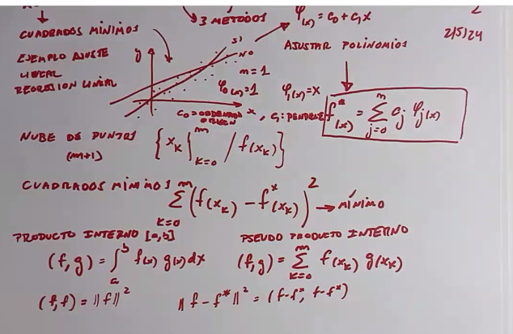
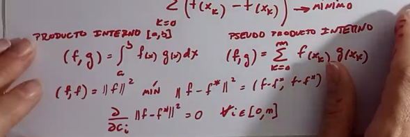
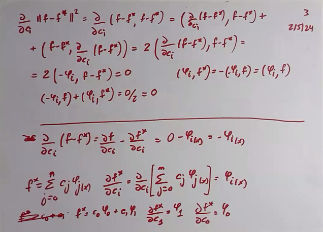
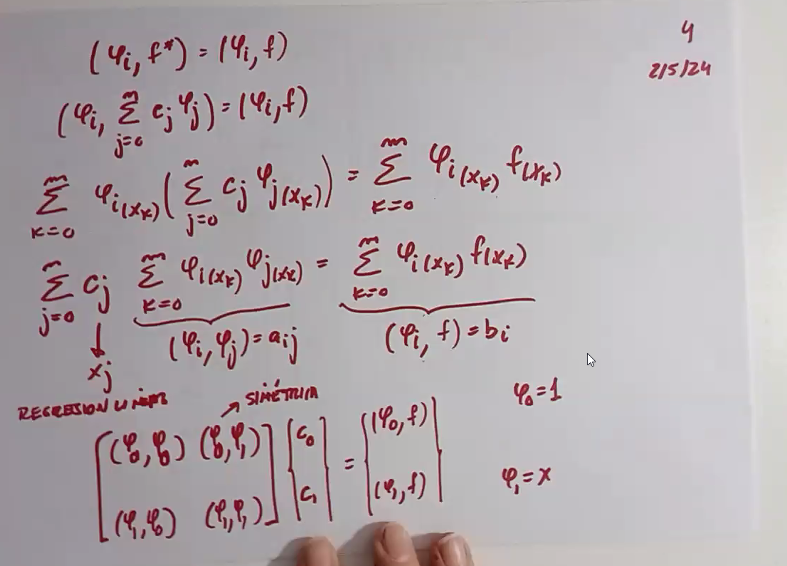
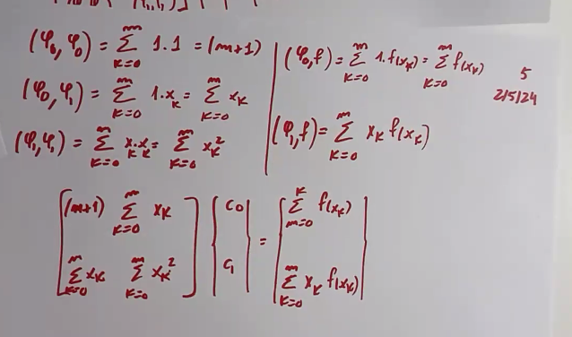
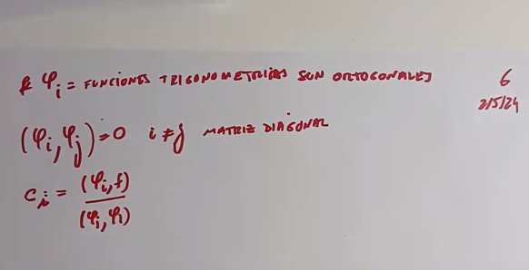
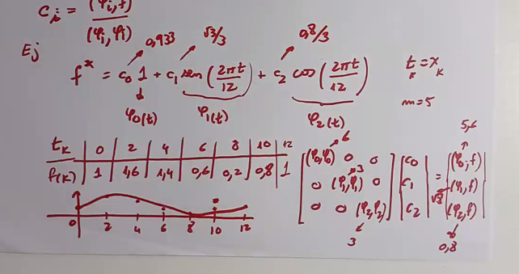

# Clase 7 - Ajuste

Dada una serie de puntos hayados por un experimento, la idea es encontrar una función que se ajuste a esos puntos. La idea es encontrar una función que pase por esos puntos, y que sea lo más simple posible.

Los puntos aparecen después de aplicar una función a una serie de puntos, más concretamente $m$ puntos (si hay 3 puntos entonces $m$ vale 2 porque se cuenta el 0). La idea es encontrar una función $f^{*}(x)$ que se ajuste a esos puntos que surgen de aplicar una función desconocida $f(x)$ a esos $x_i$ puntos.

## Ajuste vs interpolación

La diferencia entre ajuste e interpolación es que en el ajuste no necesariamente la función $f^{*}(x)$ pasa por los puntos, mientras que en la interpolación sí.

## Ajuste por cuadrados mínimos

La idea de este método es hayar un polinomio de grado $n$ que se ajuste a los puntos, minimizando la distancia entre los puntos y el polinomio en cuestión.

Para ellos debemos hayar los coeficientes $c_i$ que componen el polinomio:

$$ f^{*}(x) = \sum_{i=0}^{n} c_i \phi_i(x) $$

Donde $\phi_i(x)$ son funciones conocidas, y $c_i$ son los coeficientes que debemos hayar.

$$ \phi_0(x) = 1, \phi_1(x) = x, \phi_2(x) = x^2, \ldots, \phi_n(x) = x^n $$

Para hayar los coeficientes, debemos minimizar la distancia entre los puntos y el polinomio. Para ello, debemos minimizar la siguiente función:

$$ \sum_{i=1}^{m} [f(x_i) - f^{*}(x_i)]^2 $$

Recordamos el concepto de producto interno:

$$ \langle f, g \rangle = \int_{a}^{b} f(x)g(x)dx $$

Como estamos con una cantidad finita de puntos, pasamos de usar el producto interno y pasamos a usar un **pseudo producto interno**:

$$ \langle f, g \rangle = \sum_{i=1}^{m} f(x_i)g(x_i) $$

Y dada la propiedad:

$$ \langle f, f \rangle = ||f||^2 $$

$$ || f - f^{*}||^2 = \langle f - f^{*}, f - f^{*} \rangle $$

Concluimos que lo que queremos minimizar es:

$$ \frac{\partial}{\partial c_i} || f - f^{*}||^2 = 0 $$

### Ejemplo

