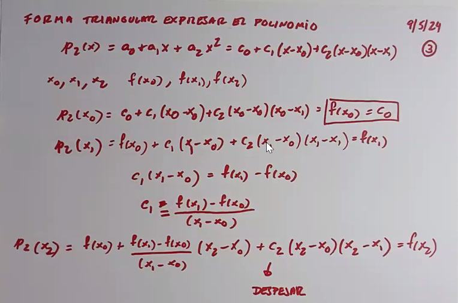

# Clase 8 - Interpolación

La idea es dado una serie de puntos escontrar una función que pase por esos puntos y que sea lo más simple posible. Mismo objetivo que en el ajuste, pero en este caso la función debe pasar por los puntos.

Como en cada punto $x_i$ se cumple que $f(x_i) = f^{*}(x_i)$, entonces el polinomio de ajuste pasa por los puntos.

## Interpolación segmentaria

En este caso, se divide el intervalo en varios segmentos, y en cada segmento se aplica un polinomio de ajuste.

### Poligonal

Se trazan segmentos de recta entre los puntos.

### Spline Cúbico

Se contruye una función mucho más suave ya que la derivada es continua en los puntos.

## Interpolación "normal"

Dado una $f(x)$, se busca un polinomio de grado $n$ que pase por los $m = n+1$ puntos. Estos puntos son los que se obtienen al evaluar $f(x)$ en los puntos $x_i$. La función a buscar la denominamos $f^{*}(x)$.

Para encontrar los coeficientes $a_i$ debemos satisfacer la siguiente ecuación:

$$ f^{*}(x) = \sum_{i=0}^{n} a_i \phi_i(x) $$

o visto de forma matricial

$$ \begin{bmatrix} \phi_0(x_0) & \phi_1(x_0) & \ldots & \phi_n(x_0) \\ \phi_0(x_1) & \phi_1(x_1) & \ldots & \phi_n(x_1) \\ \vdots & \vdots & \ddots & \vdots \\ \phi_0(x_n) & \phi_1(x_n) & \ldots & \phi_n(x_n) \end{bmatrix} \begin{bmatrix} a_0 \\ a_1 \\ \vdots \\ a_n \end{bmatrix} = \begin{bmatrix} f(x_0) \\ f(x_1) \\ \vdots \\ f(x_n) \end{bmatrix} $$

Para saber si esto tiene solución, debemos evaluar la determinante de la matriz de coeficientes. Esta deteminante en partciular se llama **determinante de Vandermonde**, y nos dice que si los $x_i$ son distintos, entonces la matriz es inversible y la determinante es distinta de 0.

### Teorema general del error en interpolación

$m=n+1$ = cantidad de puntos

Si $f \in C^{n+1}$, entonces existe un único polinomio $p(x)$ de grado a lo sumo $n$ que interpola a $f$ en los $m$ puntos.

$f(x) - p(x) = \frac{f^{(n+1)}(\xi)}{(n+1)!} \prod_{j=0}^{n} (x - x_j)$

Explica un poco los limites que puede tener el error en el polinomio de interpolación. Este se debe evaluar en un punto $\xi$ que no es ninguno de los $x_i$.

### Ejemplo

Existen unos nodos que minimizan el error de interpolación. Estos nodos son los nodos de Chebyshev.

Estos nodos de Chebyshev se encuentran en los puntos $x_i = \cos{(\frac{2i+1}{2n+2}\pi)}$.

## Interpolación de Newton

Expresamos el polinomio en forma triangular y se calculan los coeficientes con la tabla de diferencias divididas.

### Forma triangular de expresar el polinomio

$p_i(x) = \sum_{j=0}^{i} a_j \phi_j(x) = c_0 + c_1 (x - x_0) + c_2 (x - x_0)(x - x_1) + \ldots + c_i (x - x_0)(x - x_1) \ldots (x - x_{i-1}) $

$$ p_i = \sum_{j=0}^{i} c_j \prod_{k=0}^{j-1} (x - x_k) $$

### Tabla de diferencias divididas

### Relación entre diferencias divididas y derivadas

Sirve para los casos en los que se repiten los x_i ya que

### Método de Hermite (interpolación + osculación (besar))

A medida que meto restricciones agrego diferencias divididas iniciales repetidas en la tabla de modo que pueda establecer las derivadas en la segunda columna. Entiendo que si me piden derivadas de orden superior, debo establecerlas más adelante.

Es obligatorio que si se pide una derivada de orden superior, se debe establecer la derivada de orden inferior hasta el punto en sí.

## Método de interpolación de Lagrange

La desventaja de este método es que si se agrega un punto, se debe recalcular todo el polinomio.

Cada uno de los polinomios se calcula de la siguiente forma:

$$ \delta_i(x) = \prod_{j=0, j \neq i}^{n} \frac{x - x_j}{x_i - x_j} $$

Y el polinomio de interpolación es:

$$ p(x) = \sum_{i=0}^{n} f(x_i) \delta_i(x) $$
