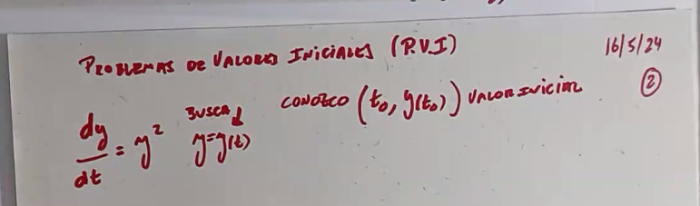
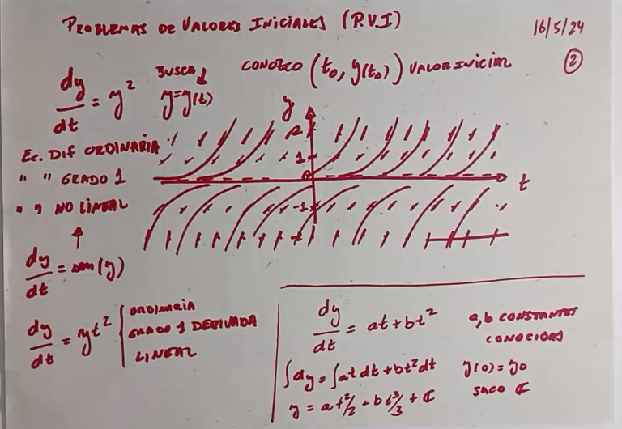
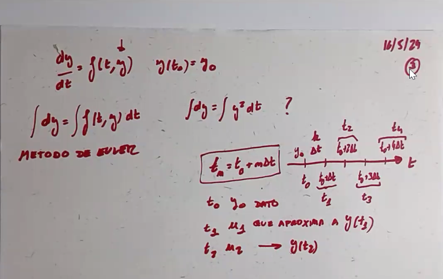
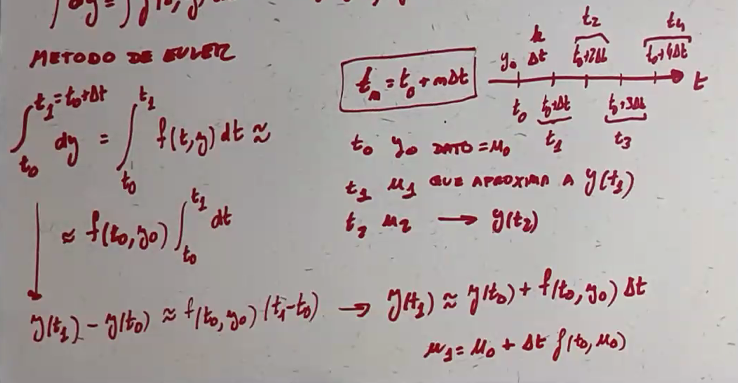
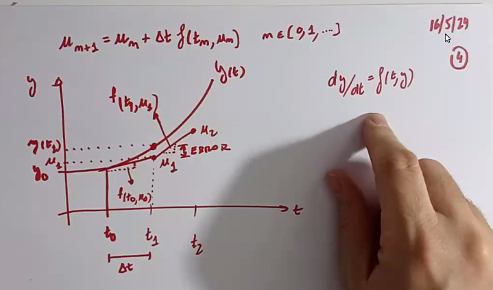
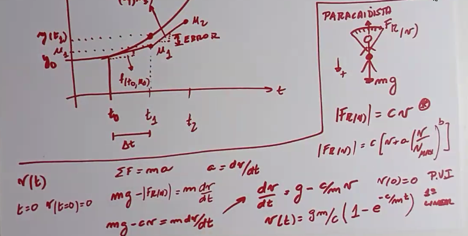
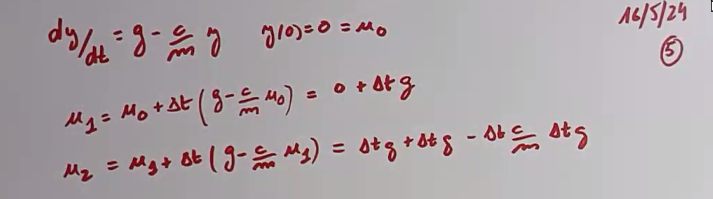
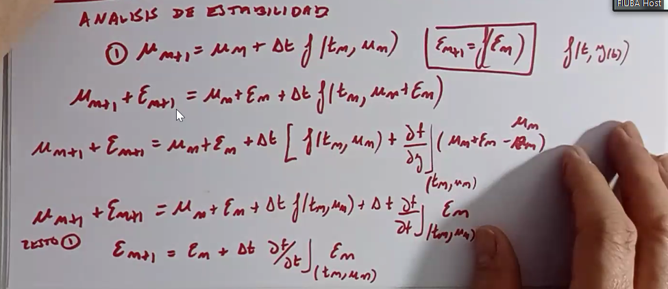
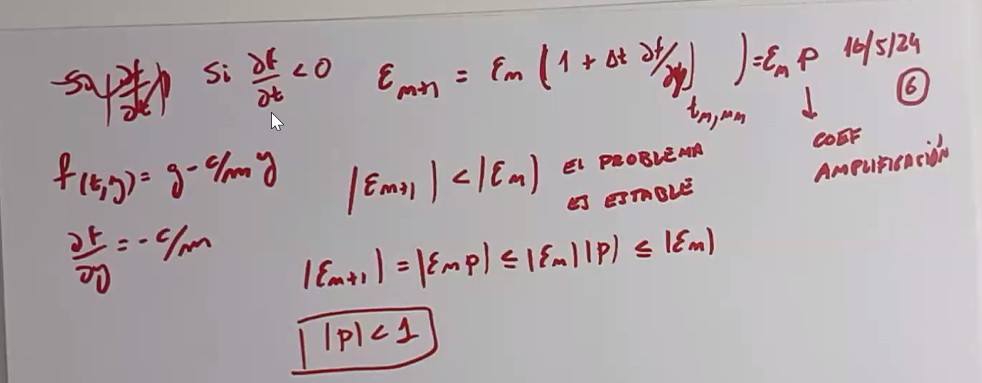
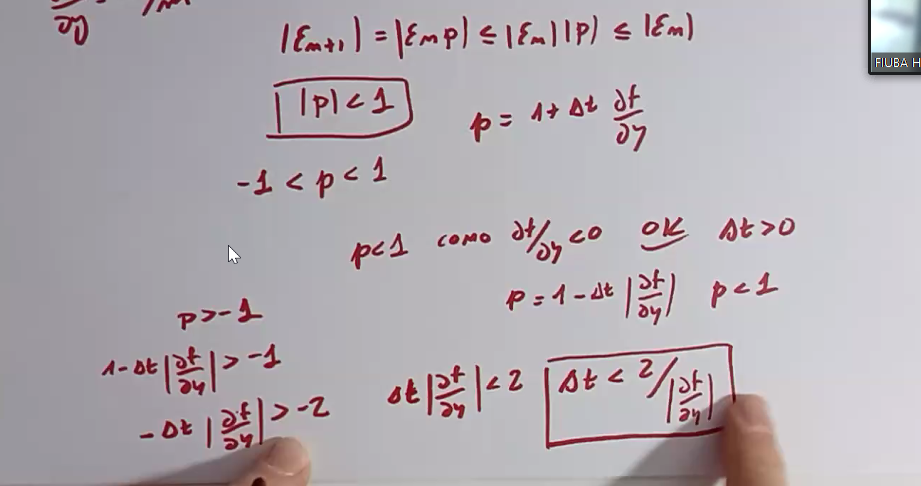

# Clase 9 - Problemas de valores iniciales

Se lo llama problema de valores iniciales a un problema de la forma:

$$ \begin{cases} y'(t) = f(t, y(t)) \\ y(t_0) = y_0 \end{cases} $$

Es decir a una ecuación diferencial de la cual buscamos conocer su valor inicial, es decir, el valor de la función en un punto $t_0$.

Las ecuaciones diferenciales se pueden clasificar de varias formas:

- **Ordinarias:** si la función depende de una sola variable independiente.
- **Parciales:** si la función depende de más de una variable independiente.

- **Lineales:** si la función es lineal en la variable dependiente y sus derivadas.
- **No lineales:** si la función no es lineal en la variable dependiente y sus derivadas.

- **Grado x:** es el orden de la derivada más alta que aparece en la ecuación.

Cabe aclarar que no toda ecuación con una derivada es una ecuación diferencial, aquellas ecuaciones que tienen la función desconocida en un solo orden de derivada no son ecuaciones diferenciales sino simples ecuaciones que se pueden resolver integrando de ambos lados y hayando la constante con el valor inicial.

## Método de Euler

Lo que plantea el método de Euler es que si conocemos el valor de la función en un punto $t_n$, podemos conocer el valor de la función en el punto $t_{n+1}$ si conocemos la derivada de la función en el punto $t_n$.

La ecuación de recurrencia es:

$$ u_{n+1} = u_n + \Delta t f(t_n, u_n) $$

Donde $u_n = y(t_n)$ es el valor de la función en el punto $t_n$, y $f(t_n, u_n)$ es la derivada de la función en ese punto, es decir $\frac{dy}{dt} = f(t, y)$.

Interpertación gráfica:

Como vemos se actualiza el valor de la pendiente en cada punto y se avanza en la dirección de la pendiente.

Ejemplo:

Si elegimos un paso de tiempo demasiado grande, la solución se vuelve inestable. Si pasamos el $\Delta t$ crítico, la solución explota y se vuelve inestable.

Se supone que a medida que aumentamos el $\Delta t$, la solución se va alejando de la solución real y el error crece de una forma cercana a lineal (dependiendo de que tan grande sea la diferencia de un $\Delta t$ con otro).

Para calcular el $\Delta t$ crítico, se puede hacer un análisis de estabilidad lineal.

Error en la hoja... la derivada es respecto a $y$ y no a $t$.

Esto solo vale para casos en los que $\frac{df}{dy} < 0 $ en otros no existe un punto crítico ya que no se garantiza la convergencia (mi hipotesis).
