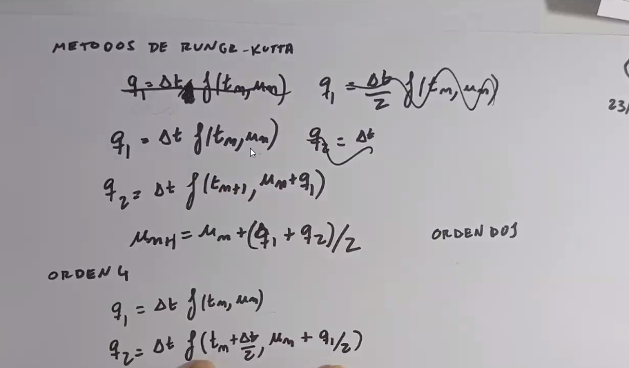

# Clase 9 - Problemas de valores iniciales

Se lo llama problema de valores iniciales a un problema de la forma:

$$ \begin{cases} y'(t) = f(t, y(t)) \\ y(t_0) = y_0 \end{cases} $$

Es decir a una ecuación diferencial de la cual buscamos conocer su valor inicial, es decir, el valor de la función en un punto $t_0$.

Las ecuaciones diferenciales se pueden clasificar de varias formas:

- **Ordinarias:** si la función depende de una sola variable independiente.
- **Parciales:** si la función depende de más de una variable independiente.

- **Lineales:** si la función es lineal en la variable dependiente y sus derivadas.
- **No lineales:** si la función no es lineal en la variable dependiente y sus derivadas.

- **Grado x:** es el orden de la derivada más alta que aparece en la ecuación.

Cabe aclarar que no toda ecuación con una derivada es una ecuación diferencial, aquellas ecuaciones que tienen la función desconocida en un solo orden de derivada no son ecuaciones diferenciales sino simples ecuaciones que se pueden resolver integrando de ambos lados y hayando la constante con el valor inicial.

## Método de Euler

### Explícito

Lo que plantea el método de Euler es que si conocemos el valor de la función en un punto $t_n$, podemos conocer el valor de la función en el punto $t_{n+1}$ si conocemos la derivada de la función en el punto $t_n$.

La ecuación de recurrencia es:

$$ u_{n+1} = u_n + \Delta t f(t_n, u_n) $$

Donde $u_n = y(t_n)$ es el valor de la función en el punto $t_n$, y $f(t_n, u_n)$ es la derivada de la función en ese punto, es decir $\frac{dy}{dt} = f(t, y)$.

Interpertación gráfica:

Como vemos se actualiza el valor de la pendiente en cada punto y se avanza en la dirección de la pendiente.

Ejemplo:

Si elegimos un paso de tiempo demasiado grande, la solución se vuelve inestable. Si pasamos el $\Delta t$ crítico, la solución explota y se vuelve inestable.

Se supone que a medida que aumentamos el $\Delta t$, la solución se va alejando de la solución real y el error crece de una forma cercana a lineal (dependiendo de que tan grande sea la diferencia de un $\Delta t$ con otro).

Para calcular el $\Delta t$ crítico, se puede hacer un análisis de estabilidad lineal.

Error en la hoja... la derivada es respecto a $y$ y no a $t$.

Esto solo vale para casos en los que $\frac{df}{dy} < 0 $ en otros no existe un punto crítico ya que no se garantiza la convergencia (mi hipotesis).

### Implicito

En este caso, la ecuación de recurrencia es:

$$ u_{n+1} = u_n +  \Delta t f(t_{n+1}, u_{n+1}) $$

Donde

$$t_{n+1} = t_n + \Delta t$$

En este caso la u_{n+1} no siempre se puede despejar de forma analítica, por lo que se debe encontrar con el método explícito.

### Método Predictor-Corrector

Está técnica se llama Predictor-Corrector, ya que se predice el valor de la función en el punto $u_{n+1}$ con el método explcito y luego se trata de corregir iterando una cantidad de veces.

$$ u_{n+1}^{(0)} = u_n + \Delta t f(t_n, u_n) $$
$$ u_{n+1}^{(k+1)} = u_n + \Delta t f(t_n + \Delta t, u_{n+1}^{(k)}) $$

## Método del punto medio

Es como el método de Euler pero en vez de calcular la pendiente en el punto de inicio, lo calculamos en el punto medio entre el $t_n$ y el $t_{n+1}$. Es decir, se calcula la pendiente en el punto $t_n + \frac{\Delta t}{2}$.

La ecucación de recurrencia es:

$$ u_{n+1} = u_n + \Delta t f(t_n + \frac{\Delta t}{2}, u_n + \frac{\Delta t}{2} f(t_n, u_n)) $$

Esto computacionalmente es el doble de pesado que el método de Euler, pero en términos del error este disminuye de forma cuadrática.

## Euler vs Punto medio

## Método de Runge-Kutta

Este método es la versión mejorada del método del punto medio, ya que se calculan más pendientes intermedias y se promedian para obtener una mejor aproximación. Esto no tiene un límite en la cantidad de pendientes intermedias que se pueden calcular, es decir el método se puede generalizar a cualquier orden.

### Orden 2

$$ k_1 = f(t_n, u_n) $$
$$ k_2 = f(t_n + \frac{\Delta t}{2}, u_n + \frac{\Delta t}{2} k_1) $$
$$ u_{n+1} = u_n + \Delta t k_2 $$

### Orden 4

$$ k_1 = f(t_n, u_n) $$
$$ k_2 = f(t_n + \frac{\Delta t}{2}, u_n + \frac{\Delta t}{2} k_1) $$
$$ k_3 = f(t_n + \frac{\Delta t}{2}, u_n + \frac{\Delta t}{2} k_2) $$
$$ k_4 = f(t_n + \Delta t, u_n + \Delta t k_3) $$
$$ u_{n+1} = u_n + \frac{\Delta t}{6} (k_1 + 2k_2 + 2k_3 + k_4) $$

### Orden n

$$ k_i = f(t_n + c_i \Delta t, u_n + \Delta t \sum_{j=1}^{i-1} a_{ij} k_j) $$
$$ u_{n+1} = u_n + \Delta t \sum_{i=1}^{n} b_i k_i $$

Donde los coeficientes $a_{ij}$, $b_i$ y $c_i$ son los coeficientes de la tabla de Butcher.

[Documento que econtre en internet (PAG 6)](https://riull.ull.es/xmlui/bitstream/handle/915/20683/Metodos%20de%20tipo%20Runge-Kutta%20y%20linealmente%20implicitos%20para%20la%20resolucion%20de%20EDOs..pdf?sequence=1&isAllowed=y)

## Estabilidad

### Condiciones de estabilidad

### Demostración

Evaluo la consistencia

### Teorema de LAX

Si un método es estable y consistente, se demuestra entonces la convergencia del método

Se explica mejor en el Libro de BURDEN
Usamos el error local de truncamiento

## Ecuaciones diferenciales de orden superior

Podemos armar un sistema de ecuaiones diferenciales de primer orden a partir de una ecuación diferencial de orden superior.

Es mas largo y tedioso, pero se puede hacer usando los métodos de primer orden. Siempre y cuando vayamos actualizando los valores para cada orden de derivada.

## Ejemplo con Range-Kutta y orden 2

## Extrapolación de Richardson

La idea usar varios \Delta t con un método de orden bajo y luego armar un sistema de ecuaciones para construir un método de orden superior.
